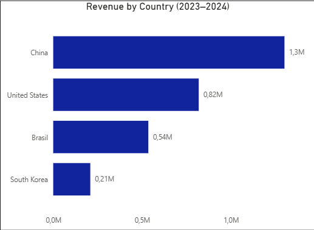
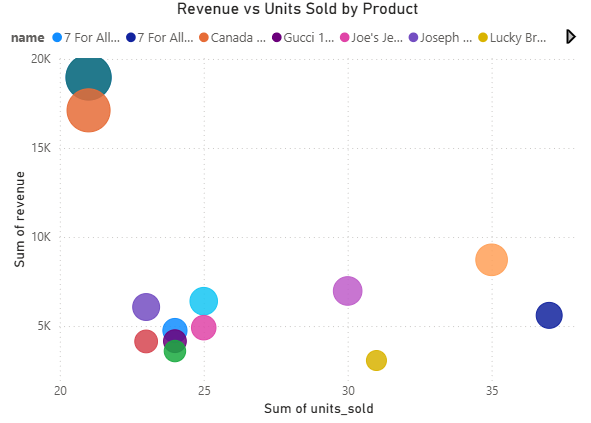
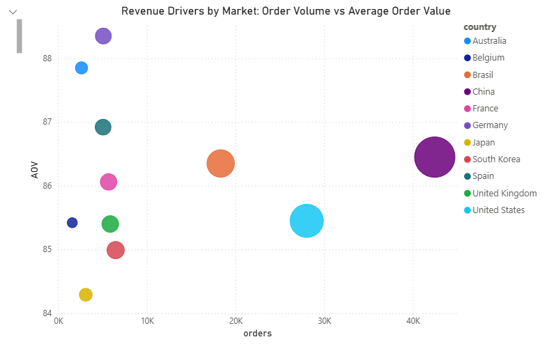

# Market, Product & Customer Performance Analysis (2023–2024)

## Project Overview
This project analyzes business performance across markets, products, and customers using transactional e-commerce data from 2023–2024.

Project exists to support stakeholder decision-making by analyzing business performance across markets, products, and customer segments using transactional e-commerce data from 2023–2024.

## TL;DR – Final Insights
👉 [Jump to Final Insights](#final-insights)

The main goal is to understand:
- how revenue is generated,
- which markets and products perform best,
- and what factors primarily drive revenue performance.

The analysis combines **SQL-based data exploration** with **business-oriented interpretation**.  
The project is designed as a **learning-focused junior portfolio project**, with room for deeper understanding over time.

---

## Business Questions
- How did key markets perform in 2023–2024?
- Which products drive revenue through value vs. volume?
- How is the customer base evolving, and do customers return?
- Is revenue driven more by order volume or by average order value (AOV)?

---

## Dataset
**thelook_ecommerce** (BigQuery public dataset)

---

## Tools
- SQL (BigQuery)
- Power BI
- Excel

---

## Core Metrics
The following metrics are used consistently throughout the analysis:
- **Orders** – count of distinct orders  
- **Revenue** – sum of `order_items.sale_price`  
- **AOV (Average Order Value)** – revenue divided by number of orders  

---

## Market Performance (2023–2024)

### Business Question
How did key markets perform in 2023–2024 in terms of revenue, order volume, and average order value (AOV)?

**Visualization:**  

### Markets Analyzed
- China  
- United States  
- South Korea  
- Brazil  

### Approach
Transactional data from 2023 and 2024 was aggregated at the country level.  
For each market, total revenue, number of orders, and AOV were calculated and compared across years to identify differences in market size and purchasing behavior.

### Key Findings
- China and the United States generated the highest total revenue in both years, driven mainly by high order volume.
- South Korea consistently showed the highest AOV despite having fewer orders.
- Brazil showed steady growth in revenue and order volume with relatively stable AOV.

### Interpretation
China and the United States represent large, volume-driven markets, while South Korea appears to be a higher-value market where customers place fewer but more expensive orders.  
This highlights meaningful differences in purchasing behavior across markets.

---

## Product Analysis – Value vs. Volume

### Business Question
Which products drive revenue, and which products drive sales volume?

**Visualization:**  

### Metrics
- **Units sold** – count of rows in `order_items`  
- **Revenue** – sum of `order_items.sale_price`

### Approach
Order-level data was aggregated at the product level by joining `order_items` with `products`.  
Products were ranked by both units sold and total revenue to compare volume-driven and value-driven performance.

### Key Findings
- High-volume products tend to generate lower revenue per unit.
- A smaller number of high-priced products drive a large share of total revenue.
- Top products by revenue differ significantly from top products by sales volume.

### Business Interpretation
Volume-driven products may support customer acquisition and visibility, while value-driven products are the primary contributors to overall revenue.

---

## Revenue Drivers – Volume vs. Value

### Business Question
Is revenue primarily driven by order volume or by average order value across markets?

**Visualization:**  

### Approach
Revenue, number of orders, and AOV were analyzed together at the country level to understand whether market performance is driven more by:
- a high number of transactions, or
- higher spending per order.

### Key Insights
- Some markets achieve high revenue mainly through large order volume.
- Other markets generate comparable revenue with fewer orders but higher AOV.
- Revenue performance should always be evaluated using both volume and value metrics together.

---

## Customer Growth & Repeat Behavior (Exploratory)

### Business Question
How is the customer base changing over time, and do customers return after their first purchase?

### Definitions
- **Customer** – unique user identified by `orders.user_id`
- **New customer** – user placing their first-ever order
- **Returning customer** – user placing at least one additional order after the first purchase

### Analysis
Customer growth was measured by identifying users placing their first order over time.  
Customer quality was explored using repeat purchasing behavior, focusing on customers with two or more orders.

### Key Insights
- Customer growth alone does not guarantee long-term business health.
- Repeat purchasing behavior is an important indicator of customer quality.
- A business driven only by first-time buyers may face sustainability risks.

> This section is exploratory and provides a high-level view without advanced retention or cohort modeling.

---

# Final insights
The analysis shows that markets and products are driven by different mechanisms: some primarily by order volume and others by order value. While volume-driven products can support customer acquisition, value-driven products are the main contributors to overall revenue. As a result, revenue performance should always be evaluated using volume and value metrics together rather than in isolation.

## File Structure
